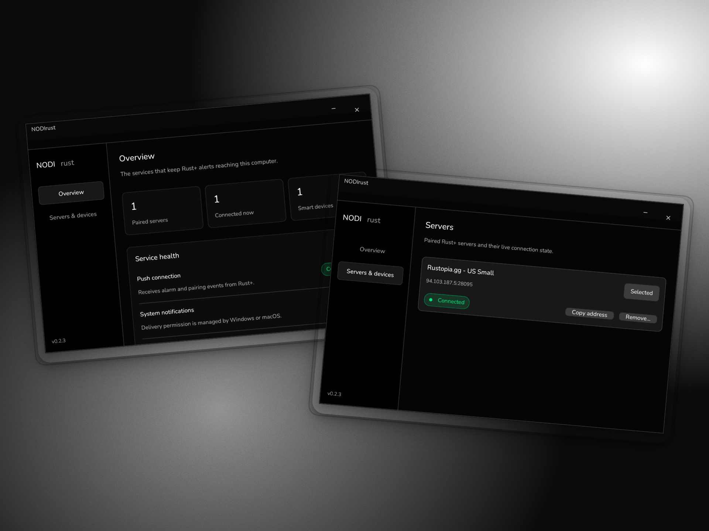
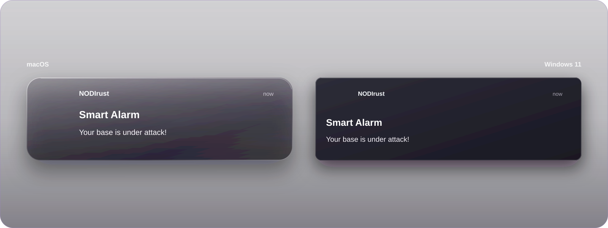

<div align="center">

# NODIrust

### Rust+ alerts on your desktop. Quiet until it matters.

A lightweight native companion that watches your paired Rust servers in the background and delivers smart-alarm events through Windows and macOS notifications.

[](https://github.com/kunihir0/nodirust/releases/latest)


[Download the latest release](https://github.com/kunihir0/nodirust/releases/latest) · [How it works](#how-it-works) · [Build from source](#build-from-source)

<br>



</div>

## Your base gets loud. NODIrust does too.

Pair your Rust+ server once, leave NODIrust in the system tray, and get a native desktop banner when a smart alarm fires. The settings window exists when you need it; the background listener is what stays running.

<p align="center">
  
</p>

## Built to disappear

| Native alerts | Tiny idle footprint | Tray-first by design |
| --- | --- | --- |
| Smart-alarm and pairing events arrive through the operating system's notification center. | Approximately **2.5 MB RAM** and **0.0% CPU** at idle on the reference setup. | Open settings when needed, close them when done, and leave only the listener running. |

| No web application | Multiple servers | Local by default |
| --- | --- | --- |
| The interface and background services are native Rust—no Electron or persistent browser runtime. | Pair servers and smart devices, see connection health, and control alerts per device. | No analytics or telemetry. Credentials and pairing state stay on your machine. |

## How it works

1. **Link Steam** through the official Facepunch login page in a temporary native webview.
2. **Pair a server and smart alarm** from Rust+ while NODIrust is running.
3. **Close the settings window.** The lightweight daemon remains available from the tray.
4. **Receive native alerts** when Rust+ sends a smart-alarm event. Click a banner to reopen NODIrust.

## Download

Prebuilt releases are available for:

- **Windows 10/11, x86_64** — portable ZIP
- **macOS, Apple Silicon** — DMG

Go to the [latest release](https://github.com/kunihir0/nodirust/releases/latest), download the build for your platform, and launch NODIrust. The app will remain accessible from the system tray or macOS menu bar.

> **Windows fullscreen notifications:** To receive notification banners while using a fullscreen app or playing a game, open **Settings > System > Notifications > Turn on do not disturb automatically**, then clear **When using an app in full-screen mode** and **When playing a game**.

## Privacy and security

NODIrust collects **zero analytics or telemetry**.

Steam authentication runs inside an ephemeral OS webview pointed at Facepunch's login portal. NODIrust never receives your Steam password. It stores the resulting Facepunch token in your local app-data directory, destroys the login window immediately, and never broadcasts the token over local IPC.

The authentication flow is intentionally small and auditable in [`crates/app/src/ui/auth.rs`](crates/app/src/ui/auth.rs).

## Architecture

NODIrust separates the always-on listener from its occasional interface:

- **Daemon** — owns Rust+ connections, push delivery, native notifications, and the tray.
- **Settings UI** — starts on demand and exits completely when closed.
- **`rustplus`** — the owned Rust+ protocol client.
- **`push_receiver`** — the owned FCM/MCS push receiver.

This keeps UI and graphics resources out of memory while the app is sitting quietly in the background.

## Build from source

```bash
git clone --recurse-submodules https://github.com/kunihir0/nodirust.git
cd nodirust
cargo build --release
```

Windows and macOS are the only supported targets.

---

<div align="center">
  <sub>Native Rust. No telemetry. No persistent web runtime.</sub>
</div>
